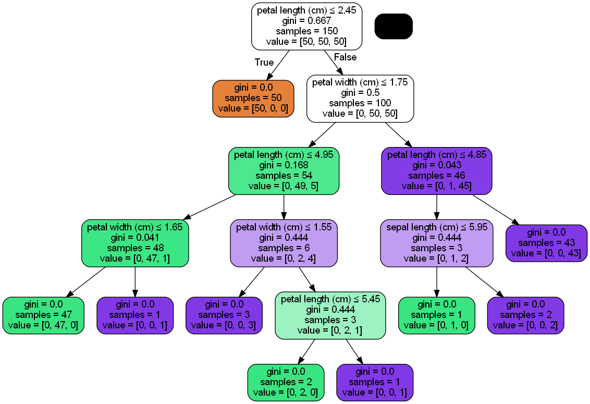

<h1 align= "center"> Prediction using Decision Tree Algorithim</h1>

## Task 6: Prediction using Decision Tree Algorithim
#### Author: Kunwardeep Singh Jagdev
---
## Description:
Decision Trees (DTs) are a non-parametric supervised learning method used for classification and regression. The goal is to create a model that predicts the value of a target variable by learning simple decision rules inferred from the data features. A tree can be seen as a piecewise constant approximation.

##### Some advantages of decision trees are:

- Simple to understand and to interpret. Trees can be visualized.

- Requires little data preparation. Other techniques often require data normalization, dummy variables need to be created and blank values to be removed. Note however that this module does not support missing values.

- The cost of using the tree (i.e., predicting data) is logarithmic in the number of data points used to train the tree.

- Able to handle both numerical and categorical data.
  
- Able to handle multi-output problems.

##### The disadvantages of decision trees include:

- Decision-tree learners can create over-complex trees that do not generalize the data well. This is called overfitting. Mechanisms such as pruning, setting the minimum number of samples required at a leaf node or setting the maximum depth of the tree are necessary to avoid this problem.

- Decision trees can be unstable because small variations in the data might result in a completely different tree being generated. This problem is mitigated by using decision trees within an ensemble.

- Predictions of decision trees are neither smooth nor continuous, but piecewise constant
---
## Project Goals: 
- Create a classifier which is able to predict the right class of the any new data fed to it.
---
## Prerequisites:
In order to perform the intended test, I'll using `python3` as the main programming language and `Jupyter Notebook` as the computing platform.
I'll also require the below mentioned libraries to perform complete the task.
   1. Pandas
   2. Numpy
   3. Plotly
   4. Matplotlib
   5. Scikit-learn
   6. pydotplus

If you do not have these libraries installed in your machine, Kindly run one of the below mentioned command.
> I recommend creating a `virtual environment` because it helps to keep dependencies required by different projects separate by creating isolated python `virtual environments` for them.

```bash
# if you use pip Packager
pip install pandas numpy plotly matplotlib notebook scikit-learn pydotplus
```
```bash
# If you are using conda Packager
conda install pandas numpy plotly matplotlib notebook scikit-learn pydotplus
```
---
## Dataset:
The dataset used in the implementation is the Iris dataset (See Table 3.1 and Fig. 3.1) with four attributes, `sepal length`, `sepal width`, `petal length`, and `petal width` and a Species label to identify the species of flower, viz., `Iris setosa`, `Iris versicolor`, and `Iris virginica`.

---
## Procedure and Result:

- Step 1:
  First of all, we import the necessary library, import the dataset and slice the important features
```python
# Importing the necessary libraries
import pandas as pd
import numpy as np
import sklearn.datasets as datasets
from six import StringIO  
from IPython.display import Image  
from sklearn.tree import export_graphviz
import pydotplus

# Importing the dataset and slicing important features
iris=datasets.load_iris()

## Forming the iris dataframe
iris_df=pd.DataFrame(iris.data, columns=iris.feature_names)
y=iris.target
```
- Step 2:
  Now we define the Decision Tree Algorithim using the ```DecisionTreeClassifier``` class from ```sklearn.tree``` module.
```python
from sklearn.tree import DecisionTreeClassifier
decision_tree = DecisionTreeClassifier()
decision_tree.fit(iris_df, y)
print('Decision Tree Classifer Created')
```
- Step 3:
  Now we visualize the decision tree
```python
dot_data = StringIO()
export_graphviz(decision_tree, out_file=dot_data, feature_names=iris.feature_names,  
                filled=True, rounded=True,
                special_characters=True)
graph = pydotplus.graph_from_dot_data(dot_data.getvalue())  
Image(graph.create_png())
```
> ##### The below mentioned graph is obtained as output:
